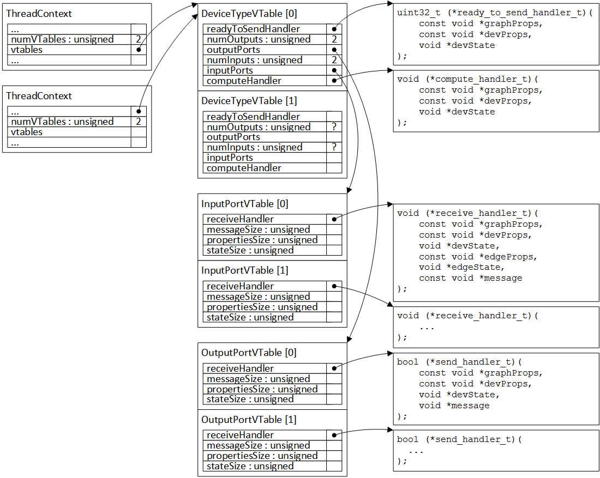
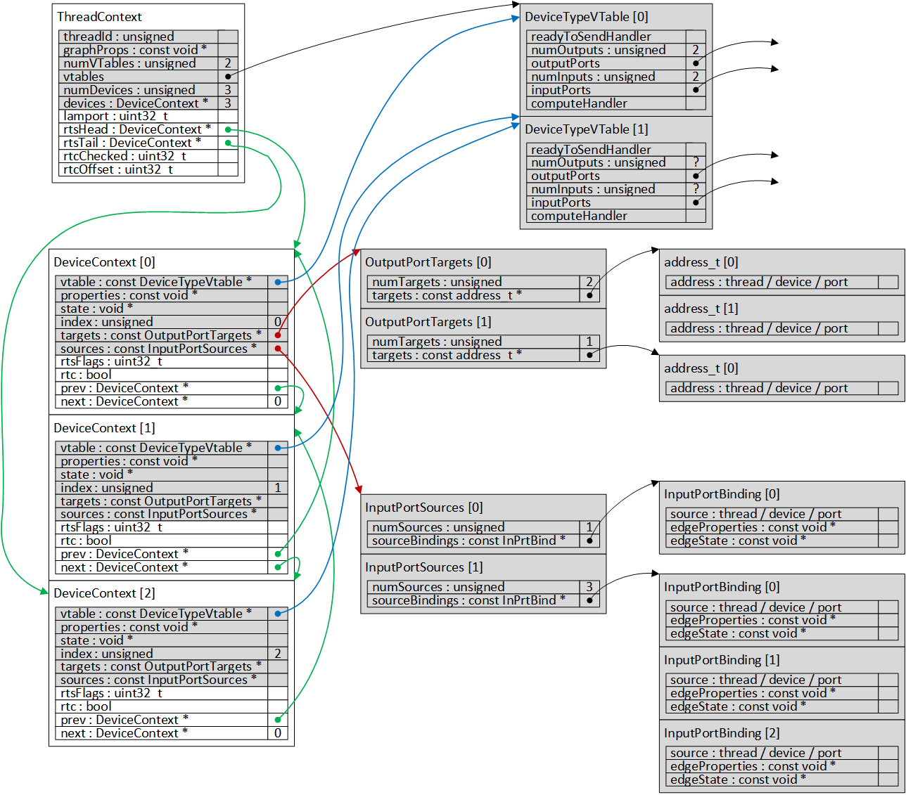

Overview
========

This is a toy softswitch designed to be
compatible with the Tinsel API underneath,
and the application model on top.

It appears to me to follow the Tinsel API
(apart from message format), and supports the
semantics of the application graphs.

Features are:

- Fixed memory footprint (no dynamic allocation)

- All configuration is accessed via a single
  pointer to a struct (the PThreadContext).

- All IO is via the Tinsel API

- Fair constant-time scheduling of send threads

- Can send messages to multiple outputs without
  an r-device, and without blocking incoming messages.

The most interesting part is probably in
[softswitch_main.cpp](src/softswitch/softswitch_main.cpp), which is the main
driver loop. It is designed so that all `tinsel_*` cores
are located in `softswitch_main`: all other parts are
pure software.

It compiles and runs, and (ignoring very minor Tinsel API
tweaks) the softswitch and application code would run on
actual hardware as-is (I think).

Tinsel API
==========

There is a simulation-only version of the Tinsel mbox API included,
which uses Unix domain data-gram sockets to send messages around,
and multiple processes to represents the multiple POETS threads.

Data Structures
===============

Threads are configured with a combination of read-only and read-write
data, which tells them about the devices they are managing,
as well as the properties of those devices. All data-structures
require a fixed amount of size, and could be linked in as a
combination of read-only and read-write data-sections.

There is the concept of a "vtable", which is pretty much
the same as a C++ vtable, but here is used to point towards
input/output handlers and meta-data associated with them.

An overview of the vtable structure is:

The entire vtable structure is read-only, and there is lots
of potential for sharing.

Each softswitch has a root structure called a "device context", which
is the single pointer needed for the softswitch to initialise itself
and start running. The device context contains pointers to the
vtables used in the thread, as well as the device instances, the
input/output edge properties, and the device state and properties.
Essentially every piece of data needed by the softswitch is
accessible via the device context, including all mutable memory.

An overview of the instance structure is:

For each output port on a device, there is a list of addresses (thread+device+port)
to which that port is connected. When a message is sent, the softswitch
will call the send handler once to prepare the message, then will walk
over the address list to deliver the message to each destination.

If an input port has properties or state, it is necessary to
look that up based on the source address (thread+device+port).
The method used here is to:
- Check if the input port vtable says it has properties. If not, don't look for them!
- Perform a binary search on the source address within the sources vector
The source list is sorted, so this is logarithmic in the number of
inputs on an edge. This could obviously be _much_ more efficient in space and time.

### RTS (Ready-to-send) list

The ready-to-send list is a doubly-linked list of devices. Every device
on the list should have `rtsFlags!=0`, meaning they want to send a message.
Any device that is not ready to send will not be on this list (nor will
it be on any other lists).

The list is managed as follows:

- When the thread has an opporunity to send a message it will pop
  the head of the RTS list, removing that device from the list.

- After any compute, receive, or send event, the device `rtsFlags`
  flags will be updated.

  - If the device was previously RTS, but now is not, the device
    will be removed from the RTS list

  - If the device was not RTS, but now is, it will be added to
    the _end_ of the RTS list.

  - If the RTS status stays the same, the list is not updated.

The upshot is that devices that go RTS and stay RTS should
slowly move to the head of the list. Once they send, they
then go to the back again. Or if a device is newly RTS, it
will also go to the back. While the applications don't
rely on it, this kind of fairness is likely to improve
throughput.

Tinsel simulation
-----------------

This toy includes a very basic softswitch which mimics the semantics
and API of the tinsel mailbox. Each hardware thread is associated with three
simulation threads:
- CPU : this runs the softswitch/application code, and calls the `tinsel_*` functions.
- incoming : trys to read messages from the network, then pushes them into the mailbox
- outgoing : trys to pull messages from the mailbox, then sends them over the network.

Communication is performed using Unix data-gram sockets. Each hardware thread gets
a socket in a chosen directory. If the directory is `base`, then each thread opens
the socket `sprintf("base/%08xl,threadId)`. The directory `base` is not cleaned
before use, so if you run the program twice, it may fail to open the sockets
again and you'll get an error.

Each hardware thread runs in its own process, as this appears to be the
only way to get `tinsel_*` functions which have an implicit thread id.
(Using `thread_local` was causing things to fail). On startup the process
will fork as many times as are needed in order to satisfy `softswitch_pthread_count`.
Each thread will then use the thread context `softswitch_pthread_context[threadId]`.

Applications
------------

Application vtables and instances are build manually, and exposed via two externs:

- `softswitch_pthread_count` - Number of threads in the entire application

- `softswitch_pthread_contexts` - Array of thread contexts

There are currently two applications:

- ring : Graph type with one device type. Each device waits for a message, adds to
  the payload of the message, then sends the message on. The devices can be
  connected in a ring, and a single device starts with the token. This will then
  ripple round the ring getting incremented. The compute will never stop.

- barrier : An all-to-all barrier. Each `dev` device is connected to every other
  device, and they move forward in lock-step using all-to-all synchronisation.
  Once they have done a number of steps (configured in the graph properties), each
  device will notify a `halt` device, which quits the program once they have all
  halted.

- edge_props : Simple example of edge properties. All the `outer` devices send a
  pulse to an `inner` device. Each incoming edge has a bit associated with it, and
  the inner device ors them together. When all bits are received, it quits.

Building and running
--------------------

The vtable and instance information is linked as data into the program.

To build a particular instance XXX, do:

    make thread_XXX

To run the instance, do:

    ./thread_XXX $(mktemp -d)

The first argument is the directory used for the unix sockets.

For example, do:

    make thread_barrier_dev3_threads2 -B
    ./thread_barrier_dev3_threads2 $(mktemp -d)

to run barrier with 4 threads (two `dev` + one `halt`), split across two
POETS (and unix) threads.
